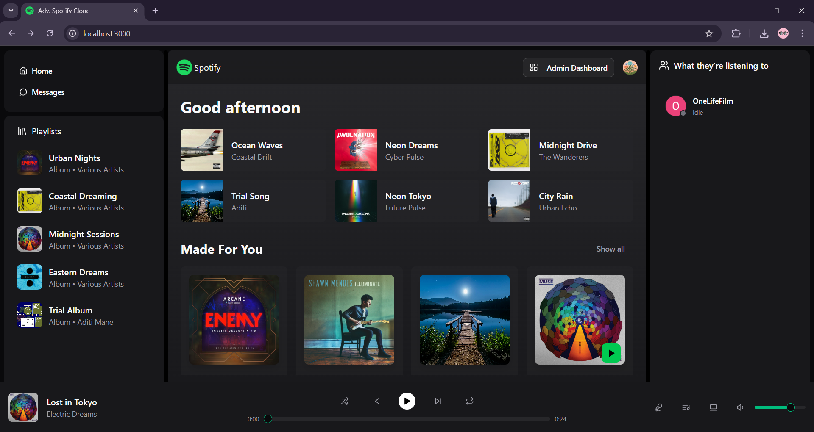
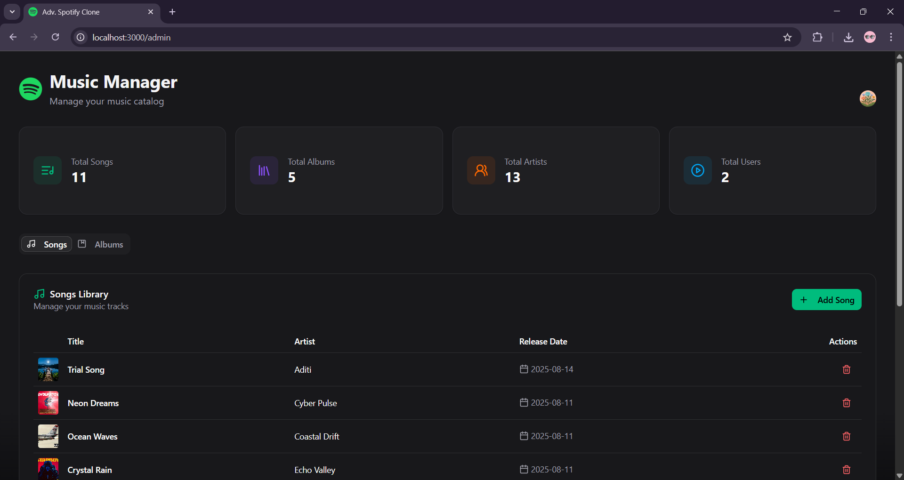
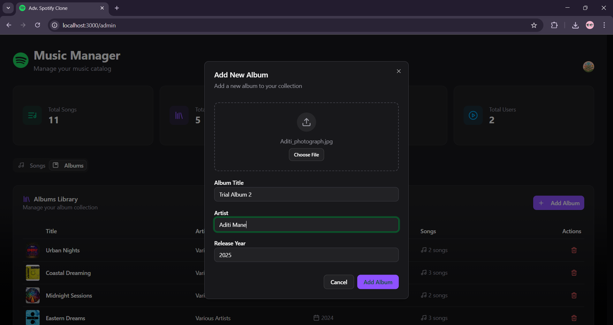
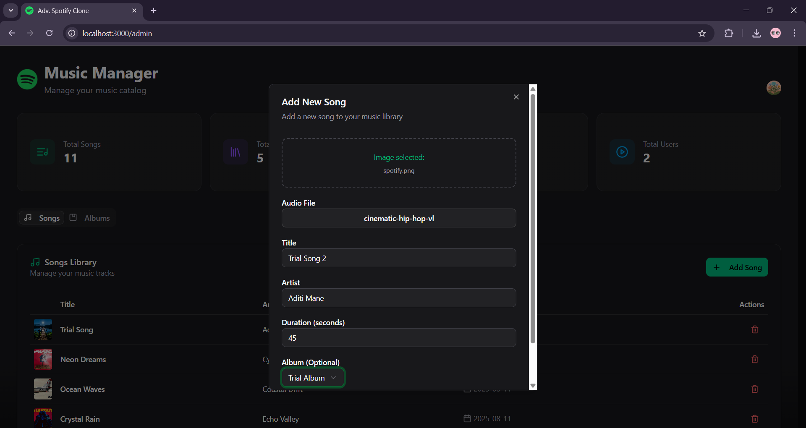
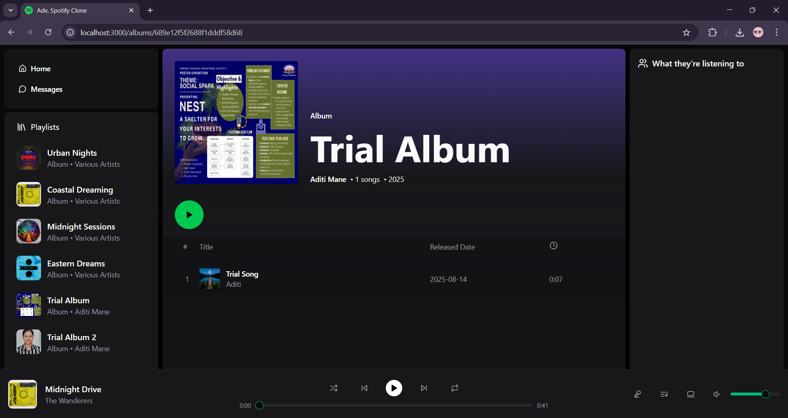
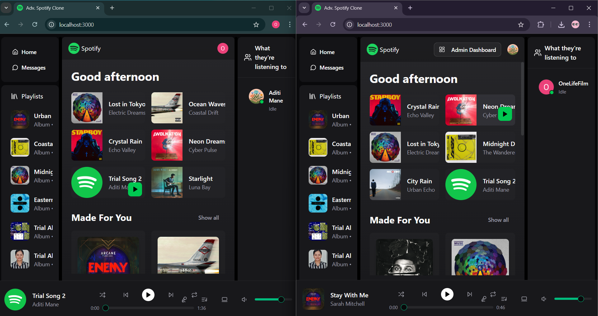
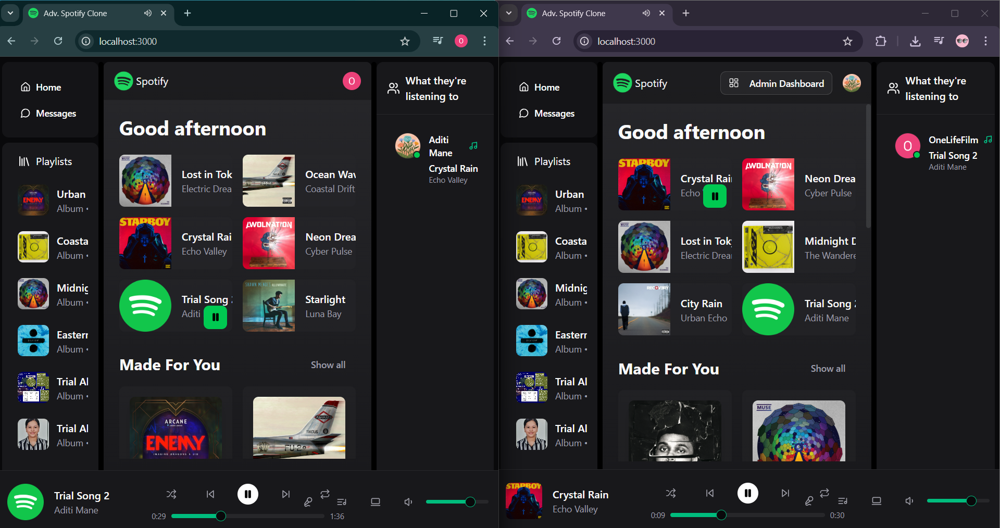
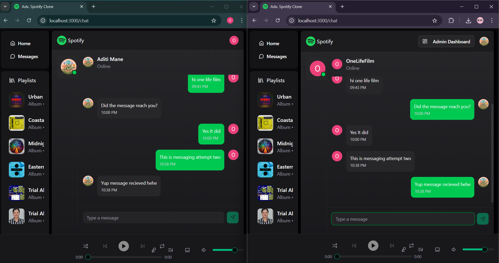

# Spotify Realtime Clone

A **Spotify Realtime Clone** that **combines music streaming, social interaction**, and **admin control**. 

## Live Demo
Check out the live application [here](https://spotify-realtime-clone.onrender.com/).

## Key Features

### 🎵 Music Playback
- **Play/Pause**, **Previous**, and **Next** song controls.  
- **Seek bar** to jump to any point in a track.  
- **Volume control** for personalized listening.  

### 🛠 Admin Dashboard *(exclusive to owner)*
- **View statistics**: total songs, albums, registered users, and artists.  
- **Add new songs and albums** directly from the dashboard.  
- **Manage platform content** with ease.

### 💿 Album Pages
- **Outlet pages** for each album with track lists and song details.  
- **Easy navigation** between albums and tracks.

### 👥 Social & Real-Time Interaction
- **See online status** of friends in real time.  
- **View currently playing tracks** of friends.  
- **Real-time chat** with friends directly from the platform.

## Tech-Stack Used 

- **Frontend:** Typescript, React.js, Zustand (state management), Axios (API requests), Shadcn (UI)
- **Backend:** Javascript, Node.js, Express.js  
- **Database:** MongoDB (Mongoose)  
- **Real-time Communication:** Socket.IO  
- **Authentication:** Clerk (user signup, login)  
- **Media Storage:** Cloudinary (for songs and album uploads)  
- **Deployment:** Render (backend & full-stack hosting)  

## Screenshots

### Homepage :

### Admin Dashboard :

### Adding a new Album :

### Adding a new Song :

### Displaying newly added Album + Song :

### Live Online Status :

### Real-Time Friend Listening Activity :

### Real-time chat :

